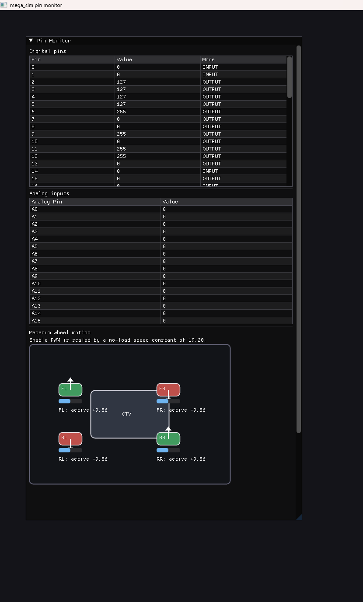
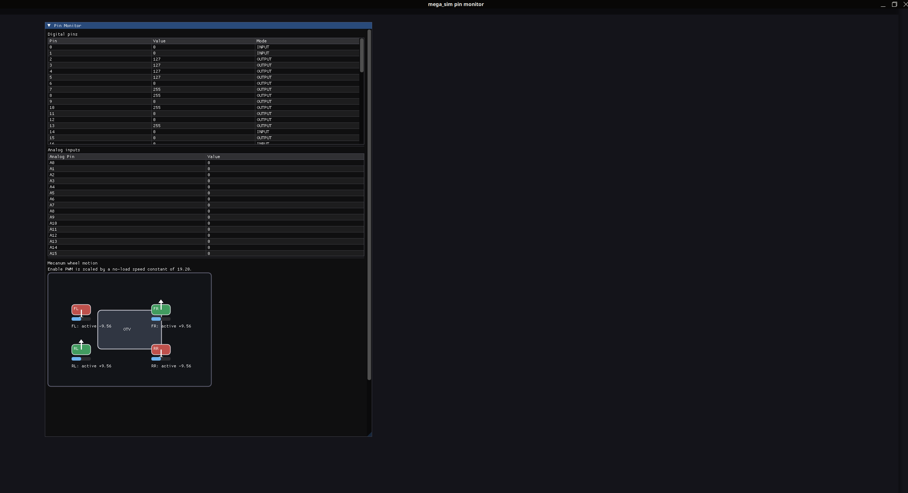

# Arduino Mega 2560 R3 OTV Simulator
This project is a simulator for the Arduino Mega 2560 R3 which runs our OTV (Over-Terrain Vehicle) software. 
    The purpose of this simulator is to allow us to test and develop our OTV software without needing to have 
    the actual hardware available, allowing for rapid development and testing. The simulator is built using 
    C++ and uses the Vulkan API for rendering the graphics (for cross-platform compatibility) and GLFW for 
    window management and input handling. The simulator is designed to be as accurate as possible to the 
    actual hardware, allowing us to test our software in a realistic environment. This project uses some 
    fake versions of the actual headers and libraries used in the actual Arduino to simulate that response. 
    Alternatives in the future would be to setup a realistic simulation that mimics the actual capabilities 
    of the hardware, but for now this is a good starting point for testing and development. To note, the main 
    differences between the real `Arduino.h` and the one that is used in this project is that it doesn't contain
    the full functionality of the actual `Arduino.h` and instead contains only the necessary functions and 
    definitions to allow our OTV software to compile and run in the simulator. This allows us to test our software 
    without needing to have the actual hardware available, but it also means that the response for some of the 
    functions may not be exactly the same as the actual hardware. However, we have tried to make the response as
    accurate as possible to the actual hardware, and we have tested the simulator with our OTV software to ensure 
    that it works correctly. Overall, this simulator is a valuable tool for testing and developing our OTV software, 
    and it allows us to iterate quickly and efficiently without needing to have the actual hardware available.

## Features
- Simulates the Arduino Mega 2560 R3 hardware
- Uses Vulkan for rendering graphics
- Uses GLFW for window management and input handling
- Uses ImGui for the user interface
- Provides a quick and easy way to see what is being printed to your pins on the Arduino without frying it
- Allows you to debug your Arduino logic without the Arduino being connected to your computer
- Simulates the directions of mecanum wheels and allows you to see the direction of each wheel in the simulator
- Simulates the movement of the OTV based on the inputs from the software and the directions of the wheels

## Future Features
- Simulate the actual physics of the OTV, allowing for more realistic movement and interactions with the environment
- Add support for more sensors and actuators, allowing for more complex simulations and testing

## Building and Running the Simulator
To build and run the simulator, you need to have the prerequisites installed on your system. Please refer to the 
    [Installation Prerequisites](Prerequisites.md) document for detailed instructions on how to install the necessary 
    software and libraries. Once you have the prerequisites installed, you can follow the instructions below to build and 
    run the simulator.

### Building the Simulator
1. Clone the repository to your local machine
2. Open a terminal and navigate to the root directory of the project
3. Create a build directory and navigate to it:
    ```bash
    mkdir build
    cd build
    ```
4. Run CMake to configure the project:
    ```bash
    cmake ..
    ```
5. Build the project using your chosen build system (e.g., Make, Visual Studio, etc.):
    - For Make (on Linux):
        ```bash
        make
        ```
    - For Visual Studio, run the following command to generate the Visual Studio solution (Windows):
        ```bash
        cmake --build . --config MinSizeRel
        ```
    - For CLion, you can simply open the project in CLion and it will automatically configure
        and build the project for you using the `.idea` directory.
### Running the Simulator
1. After building the project, you can run the simulator executable:
    - On Linux:
        ```bash
        ./mega_sim
        ```
    - On Windows:
        ```bash
        mega_sim.exe
        ```
2. As of right now, the simulator shows you the pins on the board and the directions of the wheels, but it doesn't actually simulate the movement of the OTV yet. 
    However, you can still use the simulator to see what is being printed to your pins on the Arduino without frying it, 
    and you can also use it to debug your Arduino logic without the Arduino being connected to your computer.

### Screenshots
#### Windows 11

--- -
#### Ubuntu 24.04 (via WSL)
